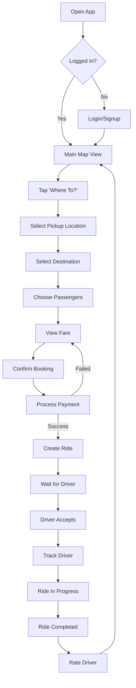
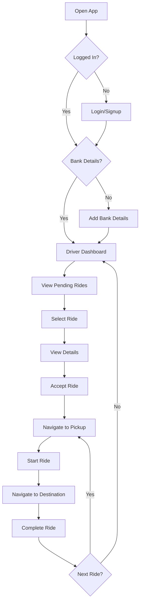

# KRides - Product Requirements Document (PRD)

**Version:** 1.0  
**Date:** November 26, 2025  
**Product:** KRides - Campus Ride-Hailing Platform  
**Platform:** React Native (iOS & Android)

---

## Executive Summary

### Product Vision
KRides is a campus-focused ride-hailing platform designed specifically for Babcock University, connecting students and staff who need transportation with drivers operating within the campus. The platform provides a safe, convenient, and affordable transportation solution tailored to the unique needs of a university environment.

### Key Objectives
- **Safety First**: Verified drivers and passengers within a closed campus environment
- **Affordability**: Fixed, transparent pricing optimized for short campus distances
- **Convenience**: Real-time ride matching with live location tracking
- **Fair Compensation**: Direct payment to drivers with minimal platform fees (₦50 per ride)

### Target Market
- **Primary**: Babcock University students and staff
- **Geographic Scope**: Babcock University campus (initial launch)
- **Market Size**: Campus population with transportation needs

### Success Metrics
- Number of active riders and drivers
- Average ride completion time
- Driver earnings and satisfaction
- Customer satisfaction ratings
- Platform revenue (₦50 per ride)

---

## Product Overview

### Product Type
Dual-application mobile platform:
1. **Customer App**: For passengers requesting rides
2. **Driver App**: For drivers accepting and completing rides

### Core Value Proposition

**For Customers:**
- Quick, reliable campus transportation
- Transparent, fixed pricing (₦200 base fare per passenger)
- Real-time driver tracking
- Safe, verified drivers
- Multiple payment options

**For Drivers:**
- Flexible earning opportunities
- Direct bank account payments
- Minimal platform fees (₦50 per ride)
- Real-time ride notifications
- Simple ride management

---

## User Personas

### Persona 1: Sarah - The Student Passenger
- **Age**: 19-22
- **Role**: Undergraduate student
- **Needs**: Quick transportation between hostel, classes, and campus facilities
- **Pain Points**: Long walking distances, limited time between classes, heavy bags
- **Goals**: Affordable, quick rides; safety; convenience
- **Tech Savviness**: High - comfortable with mobile apps

### Persona 2: David - The Campus Driver
- **Age**: 25-35
- **Role**: Part-time driver, possibly student or staff
- **Needs**: Flexible income, efficient ride management
- **Pain Points**: Payment delays, high commission fees, unclear ride information
- **Goals**: Maximize earnings, quick payments, fair treatment
- **Tech Savviness**: Medium - needs simple, intuitive interface

### Persona 3: Dr. Johnson - The Staff Member
- **Age**: 35-55
- **Role**: University faculty/staff
- **Needs**: Professional, reliable transportation for meetings and errands
- **Pain Points**: Time constraints, need for professionalism
- **Goals**: Reliability, safety, time efficiency
- **Tech Savviness**: Medium

---

## Feature Specifications

### 1. Authentication & User Management

#### 1.1 Customer Registration & Login
**Priority**: P0 (Critical)

**Features:**
- Email/password registration
- Phone number verification (OTP)
- Profile creation (name, phone, email)
- Profile photo upload (optional)
- Firebase Authentication integration
- Persistent login sessions

**User Flow:**
1. Download app → Onboarding screens
2. Choose "Sign Up" → Enter email, password
3. Enter name and phone number
4. Verify phone via OTP
5. Optional: Upload profile picture
6. Access main app

**Acceptance Criteria:**
- Users can register with valid email and password
- Phone verification required before app access
- Profile data stored in Firestore `users` collection
- Session persists across app restarts

#### 1.2 Driver Registration & Onboarding
**Priority**: P0 (Critical)

**Features:**
- Separate driver registration flow
- Vehicle ID collection
- Bank account details collection
- Flutterwave subaccount creation
- Profile verification
- Driver-specific authentication

**User Flow:**
1. Download app → Choose "Driver Sign Up"
2. Enter name, email, password, phone
3. Enter vehicle ID
4. Add bank account details (bank name, account number, account name)
5. System creates Flutterwave subaccount
6. Access driver dashboard

**Acceptance Criteria:**
- Driver profiles stored in Firestore `drivers` collection
- Flutterwave subaccount created successfully
- Bank details verified and stored
- Driver cannot access app without completing bank setup (can skip initially)

### 2. Customer Features

#### 2.1 Main Map View
**Priority**: P0 (Critical)

**Features:**
- Full-screen Mapbox map showing campus
- User's current location (blue pulsing marker)
- Real-time location updates
- Map centered on Babcock University
- Interactive map controls (zoom, pan)

**Technical Details:**
- Mapbox GL JS integration
- Street style map (`Mapbox.StyleURL.Street`)
- Location permissions required
- Geolocation API for user position

#### 2.2 Ride Booking Flow
**Priority**: P0 (Critical)

**Features:**
- Location picker for pickup and destination
- Predefined campus locations
- Number of passengers selector (1-4)
- Automatic fare calculation
- Driver selection/matching
- Payment method selection
- Ride confirmation

**User Flow:**
1. Tap "Where to?" button
2. Select pickup location (or use current location)
3. Select destination from campus locations
4. Choose number of passengers
5. View calculated fare
6. Confirm booking
7. Process payment via Flutterwave
8. Wait for driver acceptance

**Fare Calculation:**
- Base fare: ₦200 per passenger
- Additional fee: ₦50 for 1-2 passengers, ₦100 for 3+ passengers
- Example: 2 passengers = ₦200 × 2 + ₦50 = ₦450

**Acceptance Criteria:**
- Users can select pickup and destination
- Fare calculated correctly based on passengers
- Ride created in Firestore with status "pending"
- Payment processed before ride creation

#### 2.3 Real-Time Ride Tracking
**Priority**: P0 (Critical)

**Features:**
- Live driver location on map
- Route visualization (pickup to destination)
- Estimated time of arrival
- Driver details (name, phone, vehicle, rating)
- Ride status updates (pending → accepted → in_progress → completed)
- Real-time Firestore listeners

**Visual Elements:**
- Green marker: Pickup location
- Blue marker: Destination
- Blue line: Route path
- Driver's location marker (updates in real-time)

**Acceptance Criteria:**
- Map updates when driver accepts ride
- Route displayed from pickup to destination
- Driver location updates in real-time
- Status changes reflected immediately

#### 2.4 Ride History
**Priority**: P1 (High)

**Features:**
- List of completed and cancelled rides
- Ride details (date, time, locations, fare, driver)
- Ride status indicators
- Search and filter capabilities
- Sorted by most recent first

**Acceptance Criteria:**
- History fetched from Firestore
- Shows completed and cancelled rides only
- Displays accurate ride information

#### 2.5 Driver Rating
**Priority**: P1 (High)

**Features:**
- Post-ride rating screen
- 5-star rating system
- Optional feedback/comments
- Rating saved to driver profile
- Updates driver's average rating

**Acceptance Criteria:**
- Rating screen appears after ride completion
- Rating updates driver's `ratings`, `totalRatings`, and `ratingSum` fields
- Average rating recalculated

#### 2.6 Profile Management
**Priority**: P1 (High)

**Features:**
- View/edit profile information
- Update name, phone, email
- Upload/change profile picture (Cloudinary integration)
- View account statistics
- Logout functionality

### 3. Driver Features

#### 3.1 Driver Dashboard
**Priority**: P0 (Critical)

**Features:**
- Map view showing driver's location
- Pending rides list
- Active ride display
- Ride queue management
- Earnings summary

**User Flow:**
1. Driver logs in → See map with current location
2. View list of pending rides in bottom sheet
3. Accept ride → Ride moves to active
4. Complete ride → Next queued ride activates

**Acceptance Criteria:**
- Map displays driver's current location
- Pending rides update in real-time
- Driver can accept rides
- Only one active ride at a time

#### 3.2 Ride Acceptance & Management
**Priority**: P0 (Critical)

**Features:**
- Real-time pending rides feed
- Ride details preview (pickup, destination, fare, passenger count)
- One-tap ride acceptance
- Ride status management (accepted → in_progress → completed)
- Customer contact information
- Navigation to pickup/destination

**User Flow:**
1. See pending ride notification
2. View ride details
3. Tap "Accept Ride"
4. View customer details and pickup location
5. Navigate to pickup
6. Start ride (status → in_progress)
7. Navigate to destination
8. Complete ride (status → completed)
9. Next ride activates automatically

**Acceptance Criteria:**
- Pending rides appear in real-time
- Driver can accept available rides
- Ride status updates correctly
- Driver sees customer name, phone, locations
- Completed rides move to history

#### 3.3 Earnings & Payment
**Priority**: P0 (Critical)

**Features:**
- Display driver's net earnings (total fare - ₦50 platform fee)
- Ride history with earnings breakdown
- Bank account management
- Flutterwave subaccount integration
- Automatic payment splitting

**Payment Flow:**
1. Customer pays full fare via Flutterwave
2. Platform fee (₦50) goes to company account
3. Remaining amount goes to driver's subaccount
4. Driver receives payment directly to bank account

**Acceptance Criteria:**
- Driver sees net earnings (fare - ₦50)
- Payments split correctly via Flutterwave
- Bank account details stored securely
- Earnings history accessible

#### 3.4 Driver Profile & Settings
**Priority**: P1 (High)

**Features:**
- View/edit profile (name, phone, vehicle ID)
- Upload profile picture
- View ratings and statistics
- Update bank account details
- Logout functionality

### 4. Payment Integration

#### 4.1 Flutterwave Integration
**Priority**: P0 (Critical)

**Features:**
- Card payments
- Bank transfer
- USSD payments
- Subaccount payment splitting
- Transaction verification
- Payment receipts

**Technical Implementation:**
- Flutterwave React Native SDK
- Test API keys (production keys for live)
- Subaccount creation for each driver
- Flat split: ₦50 to platform, rest to driver

**Security:**
- API keys stored in environment variables
- Secure payment processing
- Transaction logging

**Acceptance Criteria:**
- Customers can pay via multiple methods
- Payments split correctly
- Transactions recorded in Firestore
- Payment confirmation triggers ride creation

### 5. Real-Time Features

#### 5.1 Firestore Real-Time Listeners
**Priority**: P0 (Critical)

**Features:**
- Real-time ride status updates
- Live pending rides feed for drivers
- Customer ride tracking
- Driver location updates
- Automatic UI updates on data changes

**Collections:**
- `rides`: All ride data
- `users`: Customer profiles
- `drivers`: Driver profiles
- `driver_locations`: Real-time driver positions
- `locations`: Predefined campus locations

**Acceptance Criteria:**
- Changes in Firestore reflect immediately in UI
- No manual refresh required
- Listeners cleaned up on component unmount

#### 5.2 Location Services
**Priority**: P0 (Critical)

**Features:**
- Continuous location tracking
- Permission management
- Background location updates (for drivers)
- Location accuracy settings
- Geolocation error handling

**Technical Details:**
- React Native Geolocation
- Mapbox LocationPuck component
- Location permissions (Android/iOS)

---

## Technical Architecture

### Technology Stack

**Frontend:**
- React Native 0.76.9
- Expo ~52.0.47
- React Navigation 6.x
- Zustand (state management)
- React Native Paper (UI components)

**Backend:**
- Firebase Authentication
- Cloud Firestore (database)
- Firebase Cloud Functions (optional)
- Firebase Storage (profile images)

**Maps & Location:**
- Mapbox GL JS (@rnmapbox/maps)
- Mapbox Directions API
- React Native Geolocation

**Payments:**
- Flutterwave React Native SDK
- Flutterwave Subaccounts API

**Image Upload:**
- Cloudinary (profile pictures)

**Other Libraries:**
- Axios (HTTP requests)
- date-fns (date formatting)
- React Native Reanimated (animations)
- React Native Gesture Handler

### Architecture Patterns

**State Management:**
- Zustand stores for global state
- Separate stores for:
  - Authentication (`useAuthStore`)
  - User details (`useUserDetails`)
  - Driver details (`useDriverDetails`)
  - Ride details (`useRideDetailsStore`)
  - Active rides (`useAcceptedRideStore`)
  - UI state (`useBottomTabStore`)

**Navigation:**
- Stack navigation for auth flows
- Drawer navigation for main apps
- Conditional rendering based on user role

**Data Flow:**
1. User action → Component
2. Component → Zustand store (if needed)
3. Component → Firebase helper function
4. Firebase → Firestore/Auth
5. Firestore listener → Update Zustand store
6. Store update → Re-render components

---

## Data Models

### Firestore Collections

#### `users` Collection
```javascript
{
  uid: string,              // Firebase Auth UID
  name: string,             // Full name
  email: string,            // Email address
  phone: string,            // Phone number
  role: "customer",         // User role
  profileImageUrl: string,  // Cloudinary URL
  createdAt: timestamp,     // Account creation date
}
```

#### `drivers` Collection
```javascript
{
  uid: string,              // Firebase Auth UID
  name: string,             // Full name
  email: string,            // Email address
  phone: string,            // Phone number
  role: "driver",           // User role
  vehicle_id: string,       // Vehicle identifier
  profileImageUrl: string,  // Cloudinary URL
  rating: number,           // Average rating (0-5)
  totalRatings: number,     // Total number of ratings
  ratingSum: number,        // Sum of all ratings
  totalRides: number,       // Completed rides count
  bankName: string,         // Bank name
  bankCode: string,         // Bank code
  accountNumber: string,    // Account number
  accountName: string,      // Account holder name
  subaccountId: string,     // Flutterwave subaccount ID
  bankDetailsVerified: boolean,
  createdAt: timestamp,
}
```

#### `rides` Collection
```javascript
{
  id: string,                    // Ride ID
  customerId: string,            // Customer UID
  customerName: string,          // Customer name
  customerPhone: string,         // Customer phone
  pickupLocation: string,        // Pickup location name
  pickupCoords: {                // Pickup coordinates
    latitude: number,
    longitude: number,
    address: string
  },
  destination: string,           // Destination name
  destinationCoords: {           // Destination coordinates
    latitude: number,
    longitude: number,
    address: string
  },
  numberOfPassengers: number,    // Passenger count
  amount: number,                // Total fare
  status: string,                // pending | accepted | in_progress | completed | cancelled
  driverId: string | null,       // Driver UID (null if pending)
  driverName: string | null,     // Driver name
  driverPhone: string | null,    // Driver phone
  vehicleId: string | null,      // Vehicle ID
  paymentMethod: string,         // Payment method
  createdAt: timestamp,          // Ride creation time
  acceptedAt: timestamp | null,  // Driver acceptance time
  completedAt: timestamp | null, // Ride completion time
  cancelledAt: timestamp | null, // Cancellation time
}
```

#### `driver_locations` Collection
```javascript
{
  driverId: string,         // Driver UID
  latitude: number,         // Current latitude
  longitude: number,        // Current longitude
  updatedAt: timestamp,     // Last update time
}
```

#### `locations` Collection
```javascript
{
  id: string,               // Location ID
  name: string,             // Location name
  latitude: number,         // Latitude
  longitude: number,        // Longitude
  category: string,         // hostel | academic | facility | other
}
```

### Firestore Security Rules

**Key Rules:**
- Users can only read/write their own profile
- Drivers can only read/write their own profile
- Customers can only update driver ratings (specific fields)
- Any authenticated user can read rides
- Only ride creator can create rides
- Customer or assigned driver can update rides
- Drivers can accept unassigned rides
- Only customer can delete their rides
- Driver locations readable by all, writable by owner

---

## User Flows

### Customer Ride Booking Flow



### Driver Ride Acceptance Flow



---

## Non-Functional Requirements

### Performance
- App launch time: < 3 seconds
- Map load time: < 2 seconds
- Real-time updates: < 1 second latency
- Payment processing: < 10 seconds
- Smooth 60 FPS animations

### Scalability
- Support 1000+ concurrent users
- Handle 100+ rides per hour
- Firestore query optimization
- Efficient real-time listeners

### Security
- Firebase Authentication for all users
- Firestore security rules enforcement
- Encrypted payment processing
- Secure API key management (environment variables)
- HTTPS for all network requests
- Input validation and sanitization

### Reliability
- 99.9% uptime target
- Graceful error handling
- Offline data persistence
- Automatic retry for failed operations
- Error logging and monitoring

### Usability
- Intuitive, clean UI
- Minimal learning curve
- Clear error messages
- Accessibility support
- Multi-language support (future)

### Compatibility
- Android 8.0+ (API 26+)
- iOS 13.0+
- React Native 0.76.9
- Expo SDK 52

---

## Security & Privacy

### Data Protection
- User data encrypted at rest (Firebase)
- Secure transmission (HTTPS/TLS)
- Minimal data collection
- GDPR compliance considerations

### Authentication
- Firebase Authentication
- Secure password storage
- Session management
- Token-based authentication

### Payment Security
- PCI DSS compliant (Flutterwave)
- No card data stored locally
- Secure payment gateway
- Transaction encryption

### Privacy
- Clear privacy policy
- User consent for location tracking
- Data retention policies
- Right to data deletion

---

## Future Roadmap

### Phase 2 Features (3-6 months)
- **In-app chat**: Customer-driver messaging
- **Scheduled rides**: Book rides in advance
- **Ride sharing**: Multiple passengers, split fares
- **Promo codes**: Discounts and promotions
- **Push notifications**: Ride updates, offers
- **Ride cancellation**: With refund policy
- **Driver analytics**: Earnings reports, performance metrics

### Phase 3 Features (6-12 months)
- **Multi-campus expansion**: Other universities
- **Corporate accounts**: Bulk bookings for events
- **Loyalty program**: Rewards for frequent riders
- **Advanced routing**: Traffic-aware routing
- **Driver verification**: Background checks, document verification
- **SOS/Emergency button**: Safety feature
- **Ride receipts**: Email/PDF receipts

### Technical Improvements
- **Backend migration**: Move to dedicated backend (Node.js/Express)
- **Secure API**: Remove client-side secret keys
- **Analytics**: Firebase Analytics, Mixpanel
- **Crash reporting**: Sentry, Firebase Crashlytics
- **A/B testing**: Feature experimentation
- **Performance monitoring**: Firebase Performance
- **CI/CD**: Automated builds and deployments

---

## Success Metrics & KPIs

### User Acquisition
- Daily active users (DAU)
- Monthly active users (MAU)
- New user registrations
- Driver onboarding rate

### Engagement
- Rides per day/week/month
- Average rides per user
- Ride completion rate
- Driver acceptance rate
- Average response time

### Revenue
- Total transaction volume
- Platform revenue (₦50 × rides)
- Average ride value
- Driver earnings

### Quality
- Average customer rating
- Average driver rating
- Ride cancellation rate
- Payment success rate
- App crash rate

### Retention
- User retention (D1, D7, D30)
- Driver retention
- Churn rate

---

## Constraints & Assumptions

### Constraints
- Campus-only operation (initial launch)
- Limited to Babcock University
- Requires internet connectivity
- Dependent on third-party services (Firebase, Mapbox, Flutterwave)
- Mobile-only (no web version)

### Assumptions
- Users have smartphones with GPS
- Reliable internet connection on campus
- Drivers have valid vehicles
- Users comfortable with mobile payments
- Campus permits ride-hailing operations

---

## Risks & Mitigation

### Technical Risks
| Risk | Impact | Mitigation |
|------|--------|------------|
| Firebase downtime | High | Implement offline mode, local caching |
| Mapbox API limits | Medium | Monitor usage, implement fallbacks |
| Payment failures | High | Retry logic, multiple payment options |
| App crashes | High | Error boundaries, crash reporting |

### Business Risks
| Risk | Impact | Mitigation |
|------|--------|------------|
| Low driver adoption | High | Competitive driver earnings, marketing |
| Regulatory issues | High | Engage with university administration |
| Competition | Medium | Focus on campus-specific features |
| Safety concerns | High | Driver verification, ratings system |

### Operational Risks
| Risk | Impact | Mitigation |
|------|--------|------------|
| Customer support load | Medium | FAQ, in-app help, automated responses |
| Payment disputes | Medium | Clear policies, transaction logs |
| Driver misconduct | High | Rating system, reporting mechanism |

---

## Appendix

### Glossary
- **Customer**: Passenger requesting a ride
- **Driver**: Person providing ride service
- **Ride**: Single trip from pickup to destination
- **Pending Ride**: Ride awaiting driver acceptance
- **Active Ride**: Ride currently in progress
- **Platform Fee**: ₦50 commission per ride
- **Subaccount**: Flutterwave account for driver payments

### References
- [Firebase Documentation](https://firebase.google.com/docs)
- [Mapbox Documentation](https://docs.mapbox.com/)
- [Flutterwave API](https://developer.flutterwave.com/)
- [React Native Documentation](https://reactnative.dev/)

---

**Document Status**: Draft v1.0  
**Last Updated**: November 26, 2025  
**Next Review**: After user feedback
